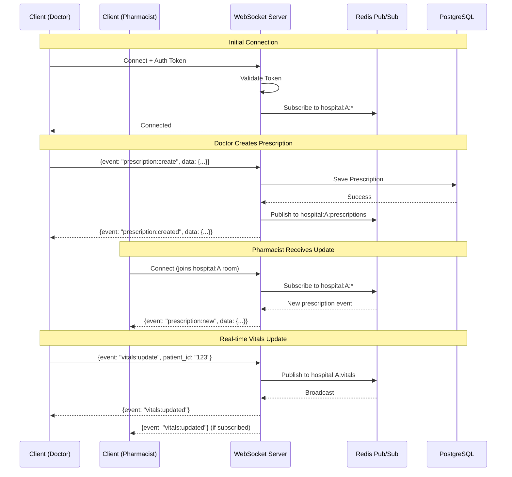

# 🏗️ HMS System Architecture Diagrams

> **Senior System Design Engineer**  
> **Hospital Management System - Complete Architecture**  
> **Date:** 2026-01-16

---

## 📊 Table of Contents

1. [High-Level System Architecture](#1-high-level-system-architecture)
2. [Frontend Architecture](#2-frontend-architecture)
3. [Backend Architecture](#3-backend-architecture)
4. [Database Architecture](#4-database-architecture)
5. [Deployment Architecture](#5-deployment-architecture)
6. [Real-time Communication Flow](#6-real-time-communication-flow)
7. [Authentication & Authorization Flow](#7-authentication--authorization-flow)
8. [Data Flow Diagrams](#8-data-flow-diagrams)
9. [Multi-Tenant Architecture](#9-multi-tenant-architecture)
10. [Scalability & Performance](#10-scalability--performance)

---

## 1. High-Level System Architecture

### Overview

```mermaid
graph TB
    subgraph "Client Layer"
        WEB["🌐 Web App<br/>(Next.js 15)"]
        ANDROID["📱 Android App<br/>(Jetpack Compose)"]
        IOS["🍎 iOS App<br/>(SwiftUI)"]
    end

    subgraph "CDN & Edge"
        CF["Cloudflare CDN<br/>Global Edge Network"]
    end

    subgraph "API Gateway Layer"
        LB["Load Balancer<br/>(Application LB)"]
        WAF["WAF<br/>Security Layer"]
    end

    subgraph "Backend Services"
        GO["Go Service<br/>(Fiber v3)<br/>Primary API"]
        PY["Python Service<br/>(FastAPI)<br/>ML & Analytics"]
        WS["WebSocket Server<br/>(Go)"]
    end

    subgraph "Data Layer"
        REDIS["Redis Cluster<br/>Cache & Pub/Sub"]
        PG["PostgreSQL<br/>(Aurora/Neon)<br/>Primary DB"]
        S3["Object Storage<br/>(S3/GCS)"]
    end

    subgraph "External Services"
        NOTIFY["Notification Service<br/>(FCM/APNs)"]
        EMAIL["Email Service<br/>(SendGrid)"]
    end

    WEB --> CF
    ANDROID --> LB
    IOS --> LB
    CF --> LB
    
    LB --> WAF
    WAF --> GO
    WAF --> PY
    WAF --> WS
    
    GO --> REDIS
    GO --> PG
    PY --> REDIS
    PY --> PG
    WS --> REDIS
    
    GO --> S3
    PY --> S3
    
    GO --> NOTIFY
    GO --> EMAIL
    
    style WEB fill:#4A90E2
    style ANDROID fill:#4CAF50
    style IOS fill:#FF9500
    style GO fill:#00ADD8
    style PY fill:#3776AB
    style REDIS fill:#DC382D
    style PG fill:#336791
```



---

## 2. Frontend Architecture

### Web Architecture (Next.js 15)


### Mobile Architecture (Native)


---

## 3. Backend Architecture

### Microservices Architecture


### Service Communication


---

## 4. Database Architecture

### Multi-Tenant Schema Design


### Database Schema (ERD - Hospital Schema)

```mermaid
erDiagram
    USERS ||--o{ PATIENTS : "manages"
    USERS ||--o{ PRESCRIPTIONS : "creates"
    PATIENTS ||--o{ PRESCRIPTIONS : "has"
    PATIENTS ||--o{ VITALS : "has"
    PATIENTS ||--o{ APPOINTMENTS : "has"
    PATIENTS ||--o{ LAB_RESULTS : "has"
    PRESCRIPTIONS ||--o{ PRESCRIPTION_ITEMS : "contains"
    PRESCRIPTIONS ||--o{ ADVERSE_EVENTS : "may_have"
    DRUGS ||--o{ PRESCRIPTION_ITEMS : "prescribed_in"
    DRUGS ||--o{ DRUG_INTERACTIONS : "interacts_with"

    USERS {
        uuid id PK
        string email
        string password_hash
        string role
        uuid hospital_id FK
        timestamp created_at
    }
    
    PATIENTS {
        uuid id PK
        string name
        date date_of_birth
        string gender
        string blood_group
        jsonb allergies
        uuid hospital_id FK
        timestamp created_at
    }
    
    PRESCRIPTIONS {
        uuid id PK
        uuid patient_id FK
        uuid doctor_id FK
        timestamp prescribed_at
        string status
        jsonb warnings
    }
    
    PRESCRIPTION_ITEMS {
        uuid id PK
        uuid prescription_id FK
        uuid drug_id FK
        string dosage
        string frequency
        int duration_days
    }
    
    VITALS {
        uuid id PK
        uuid patient_id FK
        timestamp recorded_at
        float heart_rate
        string blood_pressure
        float temperature
        float spo2
    }
    
    DRUGS {
        uuid id PK
        string name
        string category
        jsonb contraindications
        boolean in_stock
    }
```



### Caching Strategy


---

## 5. Deployment Architecture

### Development Environment


### Production Deployment (GCP)


### Auto-Scaling Strategy


---

## 6. Real-time Communication Flow

### WebSocket Architecture



### Pub/Sub Pattern


---

## 7. Authentication & Authorization Flow

### JWT Authentication Flow


### RBAC (Role-Based Access Control)


---

## 8. Data Flow Diagrams

### Prescription Creation Flow


### Real-time Vitals Monitoring


---

## 9. Multi-Tenant Architecture

### Tenant Isolation Strategy


### Tenant-Aware Caching


---

## 10. Scalability & Performance

### Load Balancing Strategy


### Performance Targets

```mermaid
graph LR
    subgraph "Performance Metrics"
        API_LATENCY["API Response Time<br/>Target: p95 < 50ms<br/>p99 < 100ms"]
        WS_LATENCY["WebSocket Message<br/>Target: < 20ms"]
        DB_QUERY["Database Query<br/>Target: < 30ms"]
        CACHE_HIT["Cache Hit Ratio<br/>Target: > 85%"]
        THROUGHPUT["Throughput<br/>Target: 50k+ req/s"]
        UPTIME["Uptime<br/>Target: 99.99%"]
    end
    
    subgraph "Monitoring"
        PROMETHEUS["Prometheus"]
        GRAFANA["Grafana Dashboard"]
        ALERTS["Alert Manager"]
    end
    
    API_LATENCY --> PROMETHEUS
    WS_LATENCY --> PROMETHEUS
    DB_QUERY --> PROMETHEUS
    CACHE_HIT --> PROMETHEUS
    THROUGHPUT --> PROMETHEUS
    UPTIME --> PROMETHEUS
    
    PROMETHEUS --> GRAFANA
    PROMETHEUS --> ALERTS
    
    style THROUGHPUT fill:#34A853
    style UPTIME fill:#4285F4
```

### Caching Strategy for Performance

```mermaid
graph TB
    REQUEST["Incoming Request"]
    
    subgraph "Cache Hierarchy"
        L1["L1: In-Memory<br/>(Go map/sync.Map)<br/>~1-2ms"]
        L2["L2: Redis<br/>(Distributed)<br/>~3-5ms"]
        L3["L3: PostgreSQL<br/>(Source of Truth)<br/>~20-50ms"]
    end
    
    REQUEST --> CHECK_L1{Check L1}
    CHECK_L1 -->|Hit| RETURN_L1["Return from Memory<br/>⚡ 1ms"]
    CHECK_L1 -->|Miss| CHECK_L2{Check L2}
    
    CHECK_L2 -->|Hit| RETURN_L2["Return from Redis<br/>⚡ 3ms"]
    CHECK_L2 -->|Miss| QUERY_L3["Query PostgreSQL<br/>⚡ 30ms"]
    
    QUERY_L3 --> STORE_L2["Store in Redis<br/>(TTL: 5-60 min)"]
    STORE_L2 --> STORE_L1["Store in Memory<br/>(TTL: 1-5 min)"]
    STORE_L1 --> RETURN_L3["Return Data"]
    
    RETURN_L2 --> STORE_L1
    
    style RETURN_L1 fill:#34A853
    style RETURN_L2 fill:#FBBC04
    style QUERY_L3 fill:#EA4335
```

---

## 📊 Summary

### Key Architecture Decisions

| Component | Technology | Rationale |
|-----------|-----------|-----------|
| **Web Frontend** | Next.js 15 + React 19 | SSR/SSG, Turbopack, best SEO |
| **Android** | Jetpack Compose | Native performance, declarative UI, 120fps |
| **iOS** | SwiftUI | Native performance, declarative UI, 120fps |
| **Primary API** | Go + Fiber v3 | 50k+ req/s, low latency, concurrency |
| **ML API** | Python + FastAPI | ML libraries, async support |
| **Database** | PostgreSQL | ACID, JSON support, mature |
| **Cache** | Redis | Fastest, pub/sub, distributed |
| **Real-time** | WebSocket + Socket.io | Bidirectional, auto-reconnect |
| **Multi-tenancy** | Schema-per-tenant | Data isolation, security, performance |
| **Deployment** | GCP Cloud Run | Serverless, auto-scaling, cost-effective |

### Performance Characteristics

- **API Throughput:** 50,000+ requests/second
- **API Latency:** p95 < 50ms, p99 < 100ms
- **WebSocket Latency:** < 20ms message delivery
- **Database Queries:** < 30ms average
- **Cache Hit Ratio:** > 85%
- **Uptime SLA:** 99.99% (52 minutes/year downtime)
- **Mobile FPS:** 120fps (native animations)
- **Web FPS:** 60fps (perceived as native)

---

**End of Architecture Diagrams**
