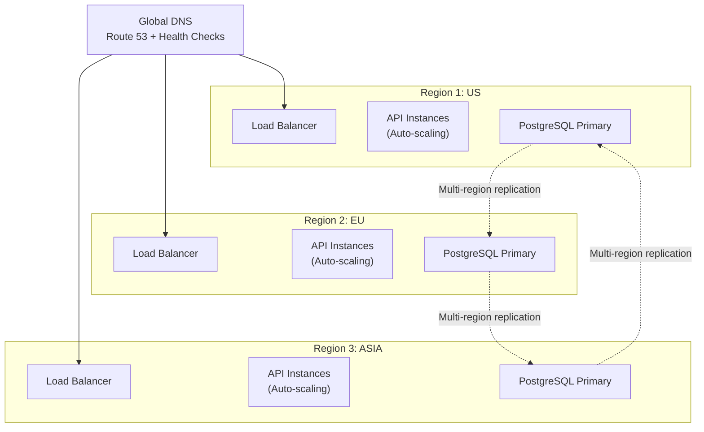
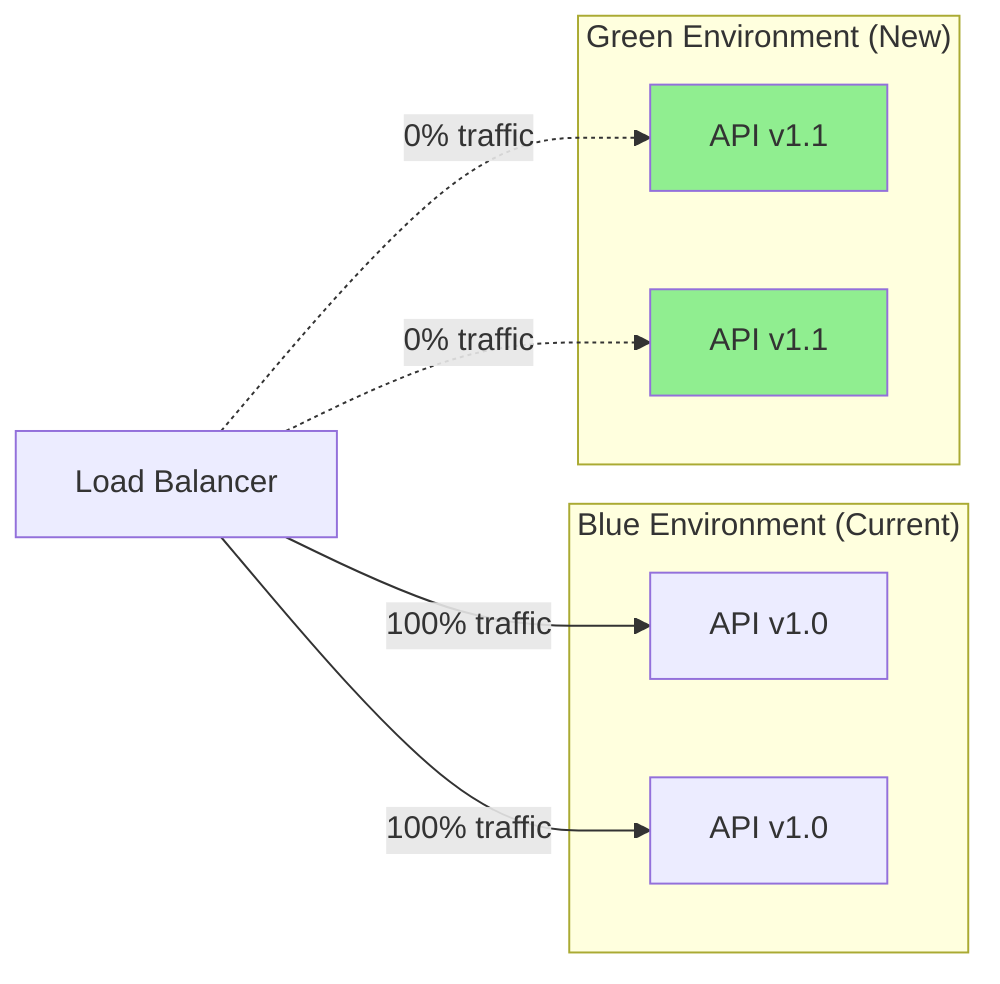
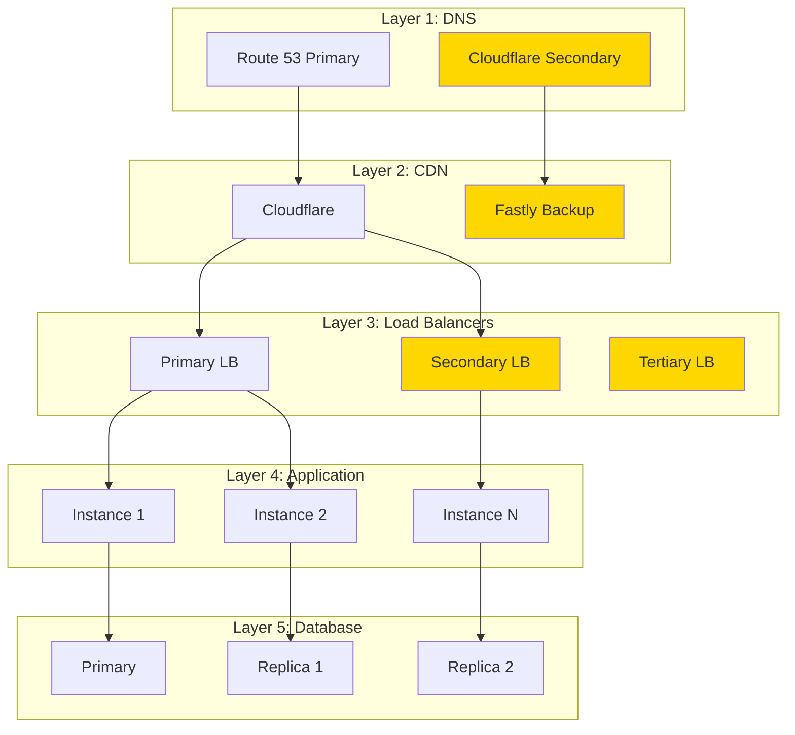

# 🎯 Achieving Five Nines Uptime (99.999%)

## Your Question: Can we achieve 99.999% uptime instead of 99.99%?

**Short Answer:** ✅ **Yes, but with significant cost and complexity increase**

---

## Uptime Comparison

| SLA | Uptime % | Downtime/Year | Downtime/Month | Downtime/Week | Cost Multiplier |
|-----|----------|---------------|----------------|---------------|-----------------|
| **Four Nines** | 99.99% | 52.6 minutes | 4.38 minutes | 1.01 minutes | 1x (Base) |
| **Five Nines** | 99.999% | 5.26 minutes | 26.3 seconds | 6.05 seconds | **3-5x** |
| **Six Nines** | 99.9999% | 31.5 seconds | 2.63 seconds | 0.605 seconds | **10-20x** |

---

## What Five Nines Means

### Downtime Allowance:
```
99.999% uptime = 5.26 minutes of downtime per YEAR
                = 26 seconds per month
                = 6 seconds per week
```

### Real-World Impact:
```
Deployment window: MUST be zero-downtime
Database maintenance: MUST be online
Server restarts: MUST use rolling updates
Network issues: MUST have instant failover
```

---

## Architecture Changes Required

### 1. Multi-Region Deployment

**Current (99.99%):**
```
Single region deployment
├── One load balancer
├── Multiple instances in one zone
└── Database with replicas in same region
```

**Five Nines (99.999%):**


**Cost Impact:**
- Single region: $300/month
- Multi-region (3): **$1,200/month** (4x increase)

---

### 2. Database High Availability

**Current (99.99%):**
```yaml
Database Setup:
  - 1 Master (single zone)
  - 2 Read Replicas (same region)
  - Automatic failover: 30-60 seconds
  - Backup: Daily snapshots
```

**Five Nines (99.999%):**
```yaml
Database Setup:
  - Multi-region active-active OR
  - Aurora Global Database with:
    - 1 Primary region
    - 2 Secondary regions
    - Cross-region replication: < 1 second
  - Automatic failover: < 1 minute
  - Continuous backup
  - Point-in-time recovery

Technology:
  - AWS Aurora Global Database
  - OR Google Cloud SQL with HA + DR
  - OR CockroachDB (distributed SQL)
```

**Cost Comparison:**
```
Current (Single region Aurora):
├── Primary: $40/month
├── 2 Replicas: $80/month
└── Total: $120/month

Five Nines (Multi-region):
├── Primary: $150/month
├── 2 Secondary regions: $300/month
├── Cross-region transfer: $50/month
├── Enhanced monitoring: $20/month
└── Total: $520/month (4.3x increase)
```

---

### 3. Zero-Downtime Deployments

**Required:**
```yaml
Deployment Strategy:
  - Blue-Green deployments (always)
  - Canary releases (gradual rollout)
  - Instant rollback capability
  - Database migrations: Online only
  - No maintenance windows

Infrastructure:
  - Kubernetes with rolling updates
  - OR Cloud Run with traffic splitting
  - Health check probes
  - Connection draining
```

**Implementation:**


**Gradual Switch:**
```
1. Deploy Green (v1.1)
2. Route 10% traffic → Test
3. Route 50% traffic → Monitor
4. Route 100% traffic → Full cutover
5. Keep Blue for instant rollback
```

---

### 4. Chaos Engineering & Monitoring

**Required:**
```yaml
Monitoring (24/7):
  - Real-time health checks (every 10s)
  - Alerting: PagerDuty + SMS + Slack
  - On-call rotation (24/7)
  - Incident response playbooks

Chaos Testing:
  - Simulate zone failures
  - Simulate database failures
  - Simulate network partitions
  - Automated recovery testing

Tools:
  - Datadog / New Relic (APM)
  - Prometheus + Grafana
  - PagerDuty (alerting)
  - Chaos Monkey (failure testing)
```

**Cost:**
```
Monitoring tools: $200/month
On-call engineers: $5,000-10,000/month
Total: $5,200-10,200/month
```

---

### 5. Redundancy at Every Layer



**Every layer has redundancy = No single point of failure**

---

## Complete Cost Breakdown

### Four Nines (99.99%) - Current Plan

| Component | Cost/Month |
|-----------|------------|
| Compute (Cloud Run) | $80 |
| Database (Cloud SQL) | $120 |
| Cache (Redis) | $100 |
| CDN (Cloudflare) | $20 |
| Monitoring | $50 |
| **Total** | **$370/month** |
| **Annual** | **$4,440/year** |

**Downtime:** 52 minutes/year

---

### Five Nines (99.999%) - Enhanced Architecture

| Component | Cost/Month |
|-----------|------------|
| **Multi-region Compute** | $350 |
| - US region (Cloud Run) | $120 |
| - EU region (Cloud Run) | $120 |
| - ASIA region (Cloud Run) | $110 |
| **Multi-region Database** | $520 |
| - Aurora Global (3 regions) | $450 |
| - Cross-region transfer | $70 |
| **Cache (Multi-region Redis)** | $300 |
| **CDN (Cloudflare Pro)** | $20 |
| **Advanced Monitoring** | $200 |
| - Datadog APM | $150 |
| - PagerDuty | $50 |
| **Load Balancers (Multi-region)** | $150 |
| **Backup CDN (Fastly)** | $100 |
| **On-call Engineers** | $8,000 |
| - 2 engineers, 24/7 rotation | $8,000 |
| **Total Infrastructure** | **$1,640/month** |
| **Total with Staff** | **$9,640/month** |
| **Annual** | **$115,680/year** |

**Downtime:** 5.26 minutes/year

---

## Cost-Benefit Analysis

### Return on Investment:

#### For HMS Application:

**Question:** Is 47 extra minutes of uptime worth $111,240/year?

```
Current: 99.99% = 52.6 min downtime
Five Nines: 99.999% = 5.26 min downtime

Improvement: 47.34 minutes/year
Cost: $111,240/year extra

Cost per minute of improved uptime:
$111,240 ÷ 47.34 = $2,350 per minute
```

**For a hospital:**
- Lost revenue during downtime: ~$500-2,000/minute
- Patient safety impact: Potentially priceless
- Reputation damage: Significant

**Verdict for HMS:** ⚠️ **Five nines is OVERKILL initially**

---

## Recommended Approach

### Phase-based Uptime Strategy:

```yaml
Phase 1: Beta (0-100 users)
  Target: 99.9% (43 hrs downtime/year)
  Cost: $100/month
  Justification: Testing, learning
  
Phase 2: Early Production (100-1k users)
  Target: 99.95% (4.4 hrs downtime/year)
  Cost: $250/month
  Justification: Single hospital, scheduled maintenance OK
  
Phase 3: Multi-Hospital (1k-10k users)
  Target: 99.99% (52 min downtime/year) ⭐ START HERE
  Cost: $370/month
  Justification: Multiple hospitals, minimize disruption
  
Phase 4: Critical Scale (10k+ users)
  Target: 99.995% (26 min downtime/year)
  Cost: $800/month
  Justification: Large scale, reputation critical
  
Phase 5: Mission Critical (50k+ users)
  Target: 99.999% (5.26 min downtime/year)
  Cost: $9,640/month
  Justification: Hospital operations depend on system
```

---

## When to Move to Five Nines

### Triggers:

✅ **Move to 99.999% when:**
1. **Revenue loss** during downtime > $2,000/minute
2. **Multiple hospitals** (10+) completely dependent on system
3. **Patient safety** directly impacted by downtime
4. **SLA requirements** from hospital contracts
5. **Competitor differentiation** (marketing advantage)
6. **Budget available** ($120k+/year for HA infrastructure)

❌ **DON'T move to five nines when:**
1. Starting out (0-1k users)
2. Single hospital deployment
3. Scheduled maintenance acceptable
4. Budget constrained
5. Manual workarounds available during downtime

---

## Practical Five Nines Architecture

If you DO decide to go for five nines, here's the setup:

### Infrastructure Stack:

```yaml
DNS & Traffic Management:
  - AWS Route 53 (health checks, failover)
  - Cloudflare (DDoS protection, CDN)
  
Compute (Multi-region):
  - GCP Cloud Run (3 regions: US, EU, ASIA)
  - Auto-scaling: 2-100 instances per region
  - Health checks: HTTP /health every 10s
  
Database:
  - AWS Aurora Global Database
  - Primary: us-east-1
  - Secondaries: eu-west-1, ap-southeast-1
  - Cross-region lag: < 1 second
  - Automatic failover: < 60 seconds
  
Caching:
  - Redis Enterprise (multi-region)
  - Active-active replication
  - Automatic failover
  
Monitoring:
  - Datadog (APM, logs, traces)
  - PagerDuty (alerting)
  - Grafana (dashboards)
  - Uptime monitoring: Pingdom + StatusCake
  
Deployment:
  - Kubernetes (GKE multi-region)
  - ArgoCD (GitOps)
  - Blue-green deployments
  - Automated rollback
  
Backup:
  - Continuous database backups
  - Point-in-time recovery (7 days)
  - Cross-region backup replication
  - Disaster recovery runbooks
```

---

## My Professional Recommendation

### For HMS Application:

**Start with 99.99% (Four Nines)**

**Why:**
1. ✅ **Cost-effective:** $370/month vs $9,640/month
2. ✅ **Achievable:** Well-established patterns
3. ✅ **Sufficient:** 52 minutes downtime/year is excellent
4. ✅ **Improve gradually:** Add regions as you scale

**Architecture for 99.99%:**
```yaml
Compute:
  - Single region, multi-zone
  - Auto-scaling (3-20 instances)
  - Rolling deployments (zero downtime)
  
Database:
  - Primary + 2 read replicas
  - Automatic failover (30s)
  - Daily backups
  
Cache:
  - Redis cluster (3 nodes)
  - Automatic failover
  
Monitoring:
  - Basic monitoring (Grafana)
  - Alerting (Slack + Email)
  - Uptime checks (UptimeRobot free)
```

**Upgrade path to 99.999%:**
```
When you reach 10+ hospitals or $1M+ ARR:
├── Add second region
├── Implement Aurora Global
├── Add Datadog monitoring
├── Hire DevOps engineer
└── Implement 24/7 on-call
```

---

## Summary

| Metric | 99.99% (Recommended) | 99.999% (Possible) |
|--------|---------------------|-------------------|
| **Downtime/Year** | 52.6 minutes | 5.26 minutes |
| **Cost/Month** | $370 | $9,640 |
| **Complexity** | Medium | Very High |
| **Team Required** | 1-2 DevOps | 3-5 DevOps + On-call |
| **Regions** | 1 | 3+ |
| **Database** | Regional HA | Global distributed |
| **For HMS** | ✅ **Perfect** | ⚠️ **Overkill initially** |

---

## Action Items

**Immediate (Now):**
- [ ] Target 99.99% uptime
- [ ] Implement single-region HA
- [ ] Setup basic monitoring
- [ ] Document runbooks

**Future (When needed):**
- [ ] Add second region (99.995%)
- [ ] Implement Aurora Global (99.999%)
- [ ] Setup 24/7 on-call
- [ ] Chaos engineering

---

**My Verdict:** ✅ Start with **99.99%**, upgrade to **99.999%** when revenue justifies it.

Five nines is absolutely achievable, but premature for a new HMS platform. Build the foundation for high availability now, add the extra nines when your business demands it.
